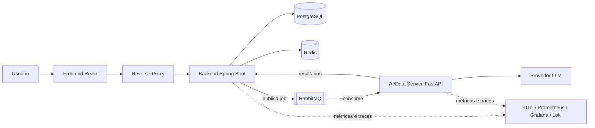
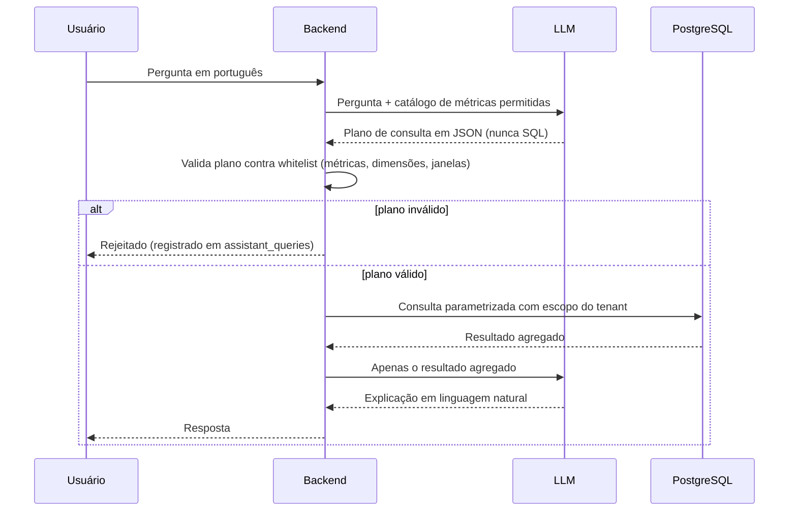

# Arquitetura do Argos

O Argos é um **monólito modular** em Java/Spring Boot, acompanhado de **um serviço Python separado** (pipeline de dados, detecção de anomalias e ponte com a LLM). A separação do serviço Python tem motivo: linguagem, ecossistema (pandas/estatística) e ciclo de vida de deploy diferentes.

## Visão geral

## Módulos do backend

| Módulo | Responsabilidade | Estado |
|---|---|---|
| `shared` | Erros padronizados, correlationId, propriedades de segurança, config | implementado |
| `identity` | Cadastro, login, JWT, refresh rotativo, RBAC, bloqueio por tentativas | implementado |
| `organizations` | Tenants (organizações) | implementado |
| `ingestion` | Upload de CUR (CSV), jobs assíncronos, status e retry | próxima etapa |
| `costs` | Consultas e agregações de custo | planejado |
| `anomalies` | Resultados e ciclo de vida das anomalias | planejado |
| `recommendations` | Recomendações por economia estimada | planejado |
| `assistant` | Perguntas em linguagem natural (plano JSON validado) | planejado |
| `audit` | Trilha de auditoria e endpoint administrativo | planejado |
| `exports` | Exportação CSV/JSON | planejado |

### Regras de modularidade

1. Cada módulo expõe uma **interface pública** (ex.: `OrganizationApi`); repositórios e entidades são internos.
2. Um módulo **nunca acessa as tabelas de outro**; referências entre módulos são por `UUID`, sem `@ManyToOne` entre módulos.
3. `organizationId` vem **sempre do JWT** (`AuthenticatedUser`), nunca do corpo ou da URL: isolamento de tenant em toda consulta.
4. Candidatos naturais a virar serviços: `ingestion` e `assistant` (carga e perfil de falha distintos).

## Fluxo do assistente (feature WOW)

A LLM nunca vê o banco, nunca executa SQL e nunca recebe dados brutos de outro tenant.

## Decisões

- [ADR-001 Monólito modular](ADR/ADR-001-modular-monolith.md)
- [ADR-002 PostgreSQL](ADR/ADR-002-postgresql.md)
- [ADR-003 RabbitMQ em vez de Kafka](ADR/ADR-003-message-broker.md)
